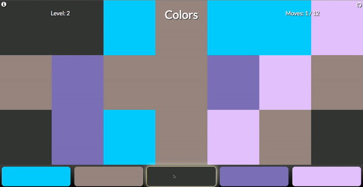
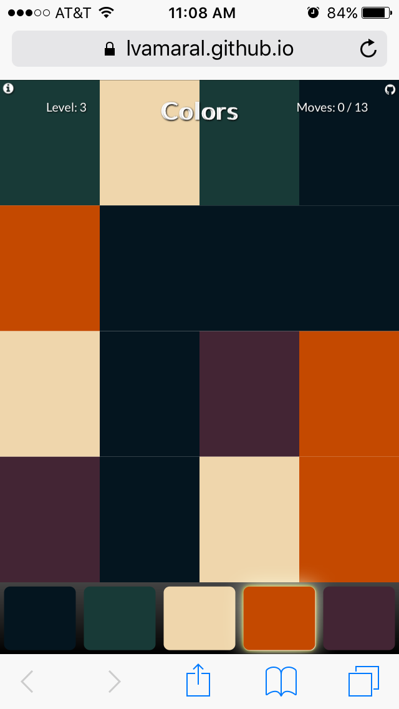
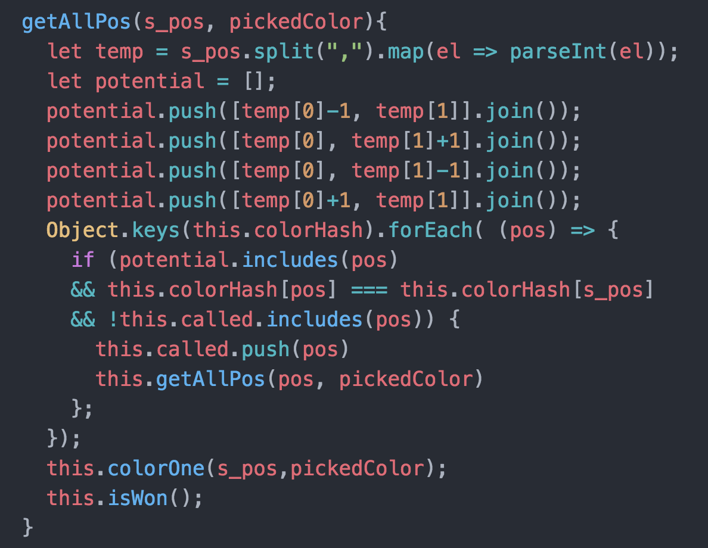

## Colors

Colors is a game based on the 2011 Blackberry game "Pixelated Plus". It consists of a randomly generated grid of squares in different colors. The player starts with the top-left square, and chooses a color to change it to. All the adjacent squares of the same color get changed to the selected color. The objective of the game is to get the entire screen to have only one color in the least amount of moves possible.

<a href="https://lvamaral.github.io/Colors/" target="_blank">Check it out!</a>

### Design and Implementation

This game was designed and developed in 3 days. The objective behind the project was to make an iteration of the game that was aesthetically pleasing, and fun to play in any device.

Check out the <a href="docs/Readme.md">original</a> proposal.

### Functionality & MVPs

The game Colors consists of:

- [ ] Randomly generated color palettes that follow artistic principles
- [ ] A responsive design that works in any device
- [ ] Ability to change adjacent squares of the same color
- [ ] Different levels of difficulty - each time the player wins, the game re-starts with smaller squares
- [ ] A move counter for each level's moves and max allowed moves

### Technicalities

The game was built primarily with JQuery and a generous use of CSS's Flexboxes. Webpack handles the packaging of different scripts together.

There were two main parts to the project: the underlying aesthetics, and the core functionality. Both had to be closely integrated for the game to work and look good.

The first step was constructing a grid that made sense for the current screen size; based on available height, the game determined how many rows and columns it should have. Thus, the game takes up the whole screen in any device size, and each cell is roughly a square (with a slightly larger width than its height).

Game on an Iphone screen. 

Each round has a randomly generated color palette, and those were made using an <a href="https://coolors.co/" target="_blank">online color palette generator</a>.

The core functionality consisted of the function that took care of converting same color adjacent squares. This was achieved using recursion, and keeping track of what had already been checked for color conversion.

Code snipped showing the recursive coloring function.

### Bonus features

There are many directions the game could go to make it more interesting. These include:

- [ ] A 1vs1 mode for competitive play against other players or A.I.  
- [ ] Add an online backend to keep track of high scores.
