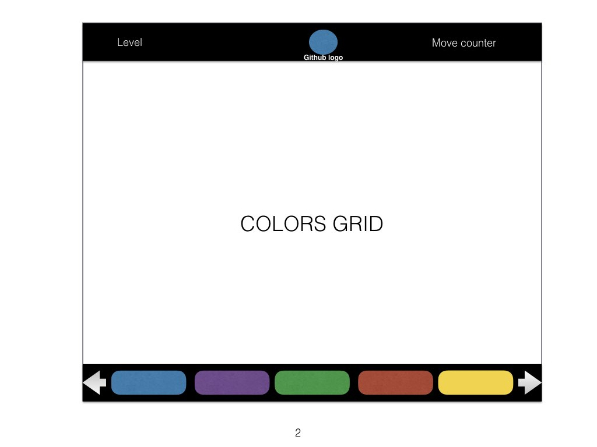

## Colors - Proposal

Colors is a game based on the 2011 Blackberry game "Pixelated Plus". It consists of a randomly generated grid of squares in different colors. The player starts with the top-left square, and chooses a color to change it to. All the adjacent squares of the same color get changed to the selected color. The objective of the game is to get the entire screen to have only one color in the least amount of moves possible.

The main objective of my iteration of this game will be to make it aesthetically pleasing, and to add functionality such as different levels of difficulty.

### Functionality & MVPs

The game Colors will consist of:

- [ ] Randomly generated color palettes that follow artistic principles
- [ ] Gameplay functionality of being able to change adjacent squares of the same color, starting with the top-left square. The game must know when a level is won.
- [ ] Different levels of difficulty - each time the player wins, the game will re-start with smaller squares, and logic to render less adjacent squares of the same color. Some levels might include adding additional colors.
- [ ] A move counter for each level's moves and an overall session move counter.

In addition, this project will include:

- [ ] A production Readme

### Wireframes

The app will consist of a single screen with a game board, and a bar for selecting colors using the arrow keys and the spacebar or mouse clicks. Another bar will display level, number of moves, and a link to my Github account.

### Architecture and Technologies

- Vanilla JavaScript and `jquery` for overall structure and game logic,
- Webpack to bundle and serve up the various scripts.

In addition to the webpack entry file, there will be three scripts involved in this project:

`board.js`: this script will handle the logic for creating and updating the necessary board elements and rendering them to the DOM.

`palette.js`: this script will be responsible for generating color palettes for the game. It will either connect to an existing online palette generator, or have logic for generating custom palettes.

`colors.js`: this script will handle the logic behind the scenes. A "unit" object will hold a 'color' and a 2D array of other units. It will be responsible for doing checks on adjacent cells, changing colors every round, and updating the array appropriately.

### Implementation Timeline

**Day 1**: Setup all necessary Node modules, including getting webpack up and running. Create `webpack.config.js` as well as `package.json`. Construct the general DOM outline of the game. Work on generating interesting color palettes. Goals for the day:

- Have all initial setup out of the way
- Have the general page setup ready.
- Be able to randomly generate color palettes.

**Day 2**: Construct the basic game interaction logic. Be able to use arrow keys and sidebar to select colors. Generate a basic random board. Goals for the day:

- Complete the `unit.js` module (constructor, update functions)
- Complete the logic to convert a square and its neighbors' colors
- Render a square grid to the page using JQuery.

**Day 3**: Create the logic for level difficulty. Every level should increase the number of squares in the board, decrease the probability of adjacent squares having the same color, and possibly increasing the number of colors in the game. Goals for the day:

- Have a functioning algorithm to generate a game based on the current level.
- Have a playable game that includes gradually more difficult levels and smooth UI.

### Bonus features

There are many directions the game could go to make it more interesting. These include:

- [ ] A 1vs1 mode for competitive play against other players or A.I.  
- [ ] Change the game to allow not only square grids, but tessellations of more interesting forms.
